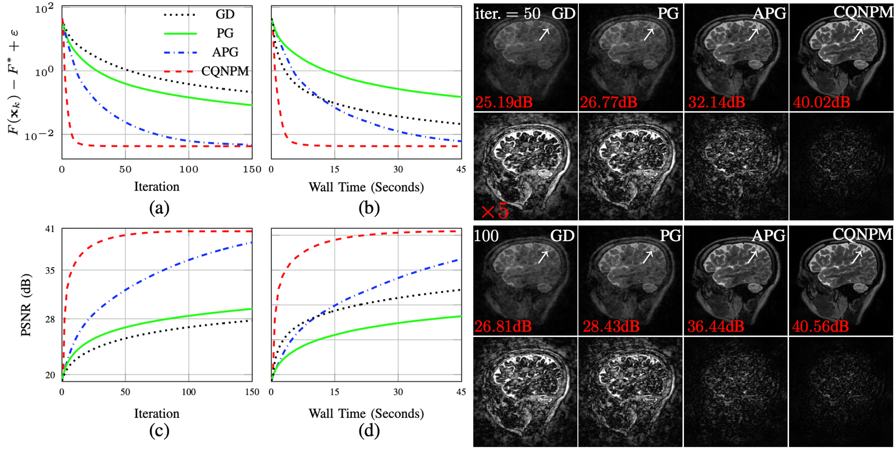

# PyTorch Implementation of Gradient-Driven Denoisers based CS MRI reconstruction.

**Reference**  
[Tao Hong](https://hongtao-argmin.github.io), Zhaoyi Xu, [Se Young Chun](https://icl.snu.ac.kr), Luis Hernandez-Garcia, and [Jeffrey A. Fessler](https://web.eecs.umich.edu/~fessler/), ``[Convergent Complex Quasi-Newton Proximal Methods for Gradient-Driven Denoisers in Compressed Sensing MRI Reconstruction](https://arxiv.org/abs/2505.04820)'', *to appear in* **IEEE Transactions on Computational Imaging**, 2025. 
Preprint: [https://arxiv.org/abs/2505.04820](https://arxiv.org/abs/2505.04820)

[Project Website](https://hongtao-argmin.github.io/CQNPM-GD-CSMRI/)

---

## Getting Started

### 1) Installation

Create a conda environment using the provided YAML file:

```bash
conda env create -f GDDenoiserCSMRIReco.yml
conda activate RandomizedNystromPre
```

---

### 2) Repository Structure & Demos

**1. `MRI/data` folder – sampling trajectories and used sensitivity maps**  

**2. Reconstruction demos** 
- `demo_CSMRIRecoGrad.py`: demo for the reconstruction with different sampling trajectories.
- `OptAlgMRIGD.py`: used opt algs.
- `TrainNNGradDenoiserMRIMag.py': function to train your own models.
- `modelsutilities.py': help functions to create models.
- `SimulatedCSMs.py`: simulate sensitivity maps.   
- **Data:** Download the test dataset and trained models from [Google Drive](https://drive.google.com/drive/folders/1dxc6j-kubl7RQ4czcG_OKetgwn7WDrjl?usp=sharing) and place it in the folder.  

---

### 3) Quick Run

```bash
python3 demo_CSMRIRecoGrad.py
```

---

## See Acceleration and Reco. Results

<p align="center">
 
</p>

## Key Insights from the Paper

1. **Introduce Convergent Complex Quasi-Newton Proximal Methods (CQNPM) for integrating gradient-driven denoisers into complex-valued compressed sensing MRI reconstruction**  

2. **Develop a Hermitian positive-definite Hessian approximation to ensure stability and provable convergence in the complex domain, even for nonconvex problems**  

3. **Experiments on Cartesian and non-Cartesian MRI reconstruction show that CQNPM achieves faster and more reliable convergence than existing first-order approaches**
   
---

## Citation

If you find this work useful, please cite:

```bibtex
@article{hong2025CQNPMCSMRI,
  title   = {Convergent Complex Quasi-{N}ewton Proximal Methods for Gradient-Driven Denoisers in Compressed Sensing {MRI} Reconstruction},
  author  = {Hong, Tao and Xu, Zhaoyi and Chun, Se Young and Hernandez-Garcia Luis and Fessler, Jeffrey A.},
  journal = {IEEE Transactions on Computational Imaging},
  volume = {11},
  pages = {1534 -- 1547},
  month = {October},
  year    = {2025},
  eprint  = {2505.04820},
  archivePrefix = {arXiv},
  primaryClass  = {eess.IV}
}
```

---

## Contact

If you encounter bugs or have questions, feel free to reach out:  
- **tao.hong@austin.utexas.edu**  
- **zhaoyix@umich.edu**

If you are interested in discussing our work further, feel free to reach out as well. 

---


